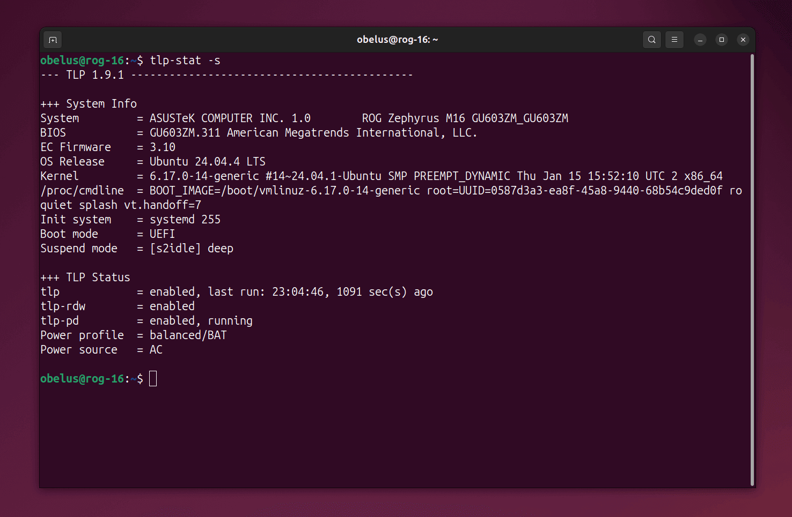
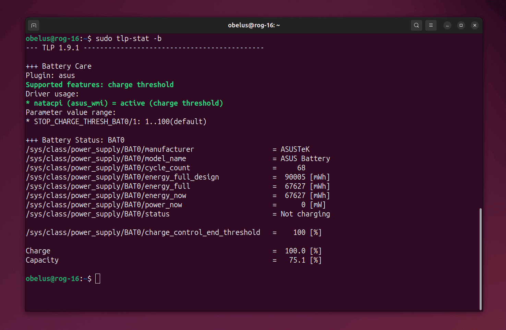
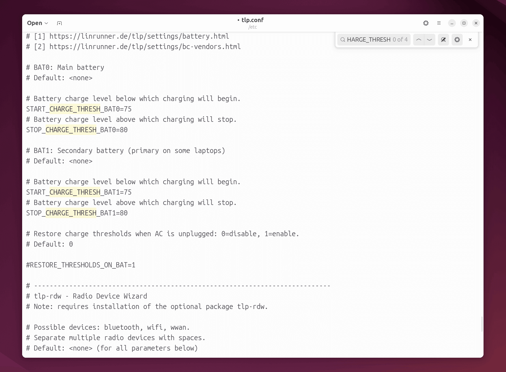
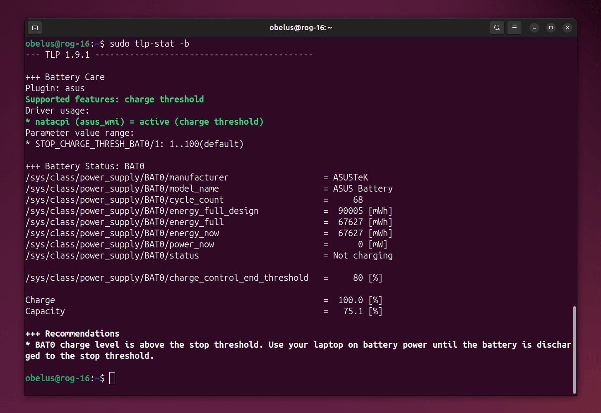

!!! note "电池充电阈值"

    某些笔记本电脑在 Windows 系统上自带了电池管理软件（例如华硕管家的 "电池健康充电"），在长期插电使用时，
    可以设置电池充电阈值（例如 80% 电量时停止充电），以此延长电池的使用寿命并减少可用容量的损失。

    在 Ubuntu 系统上，原有的电池管理软件不再生效，但可以使用专业的工具 TLP 来进行管理。以下仅介绍如何设置电池充电阈值，其他功能可参见 [TLP 官方文档](https://linrunner.de/tlp/settings/battery.html)。

!!! warning "使用前注意事项"

    充电阈值功能**高度依赖笔记本硬件支持**。对于 TLP 工具，ThinkPad 系列支持最为完美，新款
    ASUS、Dell、HP 等品牌通常也支持，但老旧机型可能无法生效。安装 TLP 后，Ubuntu 系统自带的
    **"电源模式"**（性能/平衡/省电）功能可能会被 TLP 接管并屏蔽，TLP 提供了更底层的电源管理能力。
---

- 使用工具：**[TLP](https://linrunner.de/tlp)**

!!! abstract "TLP"

    **TLP** 是一款专为 Linux 设计的高级电源管理工具，能够通过自动化调整内核参数和硬件状态，在不牺牲性能的前提下最大化笔记本电脑的电池续航。与需要手动干预的工具不同，TLP
    采用纯后台运行机制，能根据电源来源（电池/交流电）自动应用最佳的功耗策略。其功能由以下三个部分协同实现：

    - **tlp**：核心省电组件，负责底层的 CPU 频率、磁盘及 PCIe 设备功耗控制
    - **tlp-pd**（可选）：支持通过鼠标点击切换[电源配置](https://linrunner.de/tlp/introduction.html#intro-profiles)，与桌面环境（如 GNOME）电源配置集成
    - **tlp-rdw**（可选）：[无线设备管理向导](https://linrunner.de/tlp/settings/rdw.html)，提供了智能的无线设备管理功能

---

## 安装 TLP 工具

添加官方 PPA 源，并安装 TLP 组件

``` console
$ sudo add-apt-repository ppa:linrunner/tlp
$ sudo apt update
$ sudo apt install tlp tlp-pd tlp-rdw
```

---

启动 TLP 服务并检查运行状态，如果显示 `State = enabled` 则说明 TLP 已正常运行

``` console
$ sudo tlp start
$ tlp-stat -s
```



---

## 检查硬件支持

在修改配置前，先执行下列命令检查电脑是否支持修改充电阈值：

- 如果显示 `Plugin: <品牌名称>` 或 `Supported features: charge thresholds`，说明支持
- 如果显示 `Plugin: generic` 且没有提及 `thresholds`，说明不支持，后续步骤可能无效

``` console
$ sudo tlp-stat -b
```



/// caption
图中，`Supported features: charge thresholds` 说明支持充电阈值功能
///

---

## 配置充电阈值

编辑 TLP 配置文件，查找 `CHARGE_THRESH` 项 (1)
{ .annotate }

1. 可以使用快捷键 ++ctrl+f++ 快速查找关键字

``` console
$ sudo gedit /etc/tlp.conf
```

---

删除注释前缀 `#`，并根据需要修改以下配置：

- `START_CHARGE_THRESH_BAT0`，主电池的开始充电阈值
- `STOP_CHARGE_THRESH_BAT0`，主电池的停止充电阈值
- `START_CHARGE_THRESH_BAT1`，副电池的开始充电阈值
- `STOP_CHARGE_THRESH_BAT1`，副电池的停止充电阈值

!!! info "充电阈值设置"

    少数专业笔记本可能会内置两块主副电池，建议同步设置 `BAT0` 和 `BAT1` 的充电阈值。
    
    推荐的开始/停止充电阈值：`75/80`、`55/60`，可以根据日常使用情况和可用电池容量来自行设置。

    !!! tip ""

        如果需要临时把电充满（100%），只需执行下列命令即可，重启后将恢复原来的充电阈值限制
        
        ``` console
        $ sudo tlp fullcharge
        ```



---

保存文件后，执行下列命令使配置生效

``` console
$ sudo tlp start
```

---

再次检查电池状态，确认阈值是否生效 `charge_control_end_threshold `

``` console
$ sudo tlp-stat -b
```



/// caption
图中，`/sys/class/power_supply/BAT0/charge_control_end_threshold` 即为停止充电阈值
///
