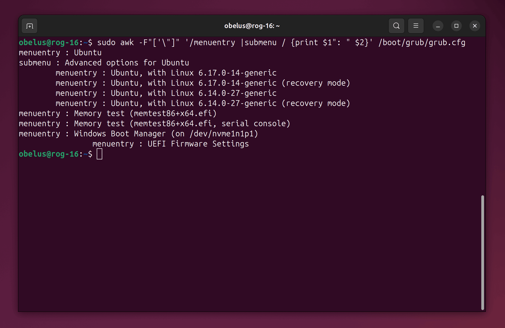
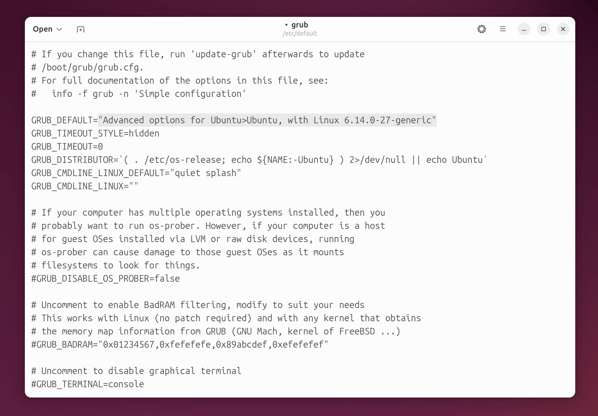

!!! abstract "引导加载程序（Boot Loader）"

    安装 Ubuntu 系统后，其引导加载程序 **GNU GRUB** 可能会接管电脑的启动流程，优先于 Windows Boot Manager（Windows
    启动管理器），导致开机后会进入 GNU GRUB 菜单，且默认第一项为 Ubuntu。

    **可以通过更改 BIOS 或 GRUB 的启动项，设置开机后默认进入 Windows 或 Ubuntu 系统。**

!!! example "两种启动项配置方式"

    <div class="grid cards" markdown>
    
    -   **更改 BIOS 默认启动项（以 Windows 为主）**

        如果日常主要使用 Windows 系统，那么可以将 BIOS 的第一启动项改为 Windows Boot Manager（Windows
        启动管理器），开机后直接进入 Windows 系统。如果之后想切换至 Ubuntu 系统，需要进入 BIOS 中选择。
    
    -   **更改 GRUB 默认启动项（以 Ubuntu 为主）**

        如需在开机后仍进入 GNU GRUB 菜单，但更改第一启动项（在倒计时结束后，自动启动所选系统），可以对配置文件进行修改。
        
        另外，安装其他 Linux 内核版本后，也可以通过更改默认项优先使用指定的内核版本。
    
    </div>

=== "更改 BIOS 默认启动项"

    首先进入 BIOS，启动电源/重启系统后，在载入前界面（通常只有 1~2s ）按下特定的按键进入

    !!! question "如何进入 BIOS"
    
        不同的主板/电脑进入 BIOS 的按键和操作方法不尽相同，常见的如：++f2++、++f12++、++delete++、++esc++
        等，建议根据主板品牌/型号查询，如搜索 "华硕主板如何更改启动项"。

    ---

    以华硕主板为例，通常在 BIOS（Advanced Mode）的 **"Boot"**（启动）栏中，设置 **"Boot Option #1"**（启动选项 #1）为
    `Windows Boot Manager`（Windows 启动管理器），最后保存更改即可

    

    /// caption
    华硕主板的 BIOS 界面（旧版本），图片来源于华硕官网
    ///

=== "更改 GRUB 默认启动项"

    执行下列命令，查看 GRUB 配置文件中的所有启动项的顺序和名称

    ``` console
    $ sudo awk -F"['\"]" '/menuentry |submenu / {print $1": " $2}' /boot/grub/grub.cfg
    ```
    
    

    ???+ info "GRUB 菜单选项"

        在上述命令的输出结果中，每段不带缩进（除了最后一项）的 `menuentry` 和 `submenu` 分别按顺序对应主菜单的选项，其中
        `submenu` 下带行首缩进的 `menuentry` 为子菜单选项。在开机启动的 GRUB 中只会显示主菜单的选项。
 
        

    ---

    编辑 GRUB 配置文件

    ``` console
    $ sudo gedit /etc/default/grub
    ```

    ---

    将文件中 `GRUB_DEFAULT` 的值，改为指定启动项的**索引值**（从 0 计数）或**名称**，并保存文件

    !!! info "子菜单（Submenu）"

        菜单的启动项也可以用索引值（从 0 计数）或完整名称表示。建议使用完整名称，以免内核更新或启动项变动导致索引错误。
    
        如果启动项在子菜单，需要使用 `>` 符号连接，并用 `""` 双引号括起来，例如（下列两者等价）：

        - `GRUB_DEFAULT="1>2"`
        - `GRUB_DEFAULT="Advanced options for Ubuntu>Ubuntu, with Linux 6.14.0-27-generic"`
        
        > 如果 Ubuntu 系统系统为中文，其启动项的名称也为中文

    !!! tip "记忆上次选择"

        如果需要默认选中上一次成功进入的系统，可以将 `GRUB_DEFAULT` 改为 `saved`，然后在其下方新增一行 `GRUB_SAVEDEFAULT=true`

    

    /// caption
    图中，将默认启动项更改为 Ubuntu 高级选项（主菜单）中的 Linux 6.14.0-27 内核版本（子菜单）
    ///

    ---

    重新生成 GRUB 配置文件，使更改生效

    ``` console
    $ sudo update-grub
    ```
