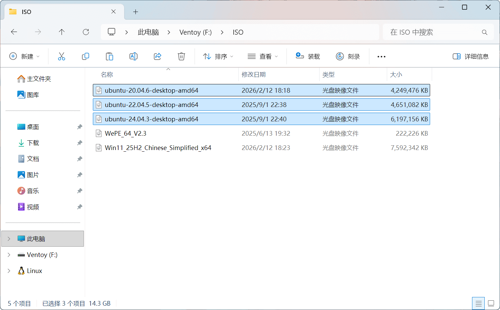

## 准备 U 盘

!!! warning "U 盘要求"

    - 可用空间至少为 8GB
    - 建议 USB 3.0 及以上接口
    - 安装前无任何重要数据（需要格式化）

---

## 制作启动盘

- 使用工具：**[Ventoy](https://www.ventoy.net/)**

!!! abstract "Ventoy"

    **Ventoy** 是一款多系统启动盘制作工具。最大的特点是第一次格式化安装后，不仅支持多
    ISO/系统启动引导（无需多次格式化写入镜像），并且不会影响文件存储的正常使用，兼容性强且完全开源。

!!! quote ""

    - **官方网站**：<https://www.ventoy.net/cn/download.html>
    - **GitHub**：<https://github.com/ventoy/Ventoy/releases>
    - **南京大学镜像站**：<https://mirrors.nju.edu.cn/github-release/ventoy/Ventoy>
    - **山东大学镜像站**：<https://mirrors.sdu.edu.cn/github-release/ventoy_Ventoy>

/// caption
从 U 盘引导启动后，自动检索可用的镜像文件
///

---

对于一般的启动盘而言，选择默认的配置/安装方式即可

> 分区格式与文件系统保持默认即可，不会影响 Ubuntu 安装，具体介绍可见下文

!!! danger "务必提前备份数据！"

    一旦安装将格式化 U 盘（清除所有数据），务必确保重要文件已备份！安装完成后可以再将文件转回 U 盘。

---

Ventoy 安装至 U 盘后，U 盘会被分为两个分区，**Part1（Ventoy）**和 **Part2（VTOYEFI）**，如下图所示：

{ width=375 }

/// caption
分区类型：MBR
///

{ width=400 }

/// caption
分区类型：GPT
///

- **Part1（Ventoy，exFAT）**：用户数据区，用于存放镜像文件和一般文件，作为正常的 U 盘空间使用
- **Part2（VTOYEFI，FAT）**：隐藏的引导分区，用于存放 Ventoy 的核心文件，例如引导启动文件等

---

!!! tip "Ventoy 会自动查找并识别 ISO 镜像文件"

    只需将 Ubuntu 的 ISO 镜像文件（`.iso`）放置在 Ventoy 分区的**任意目录（文件夹）**下即可，选择该
    U 盘引导启动时会自动查找并识别 ISO 镜像文件。文件名不建议包含中文或特殊字符，以免引导时显示乱码。

/// caption
例如，可以将镜像文件放置在 ISO 文件夹中
///
