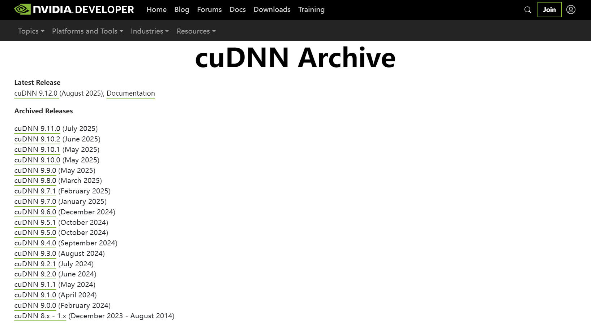
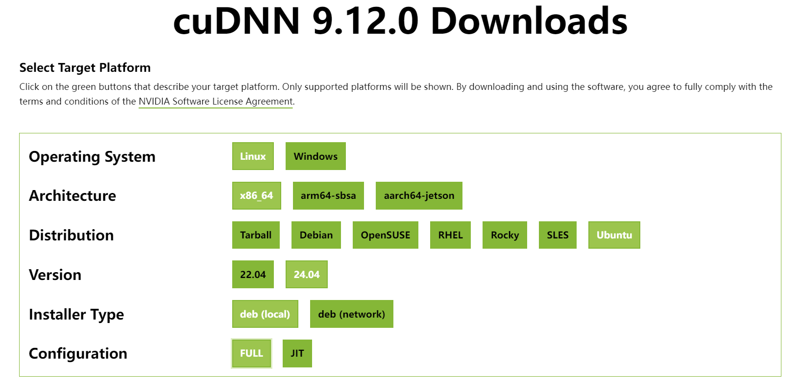
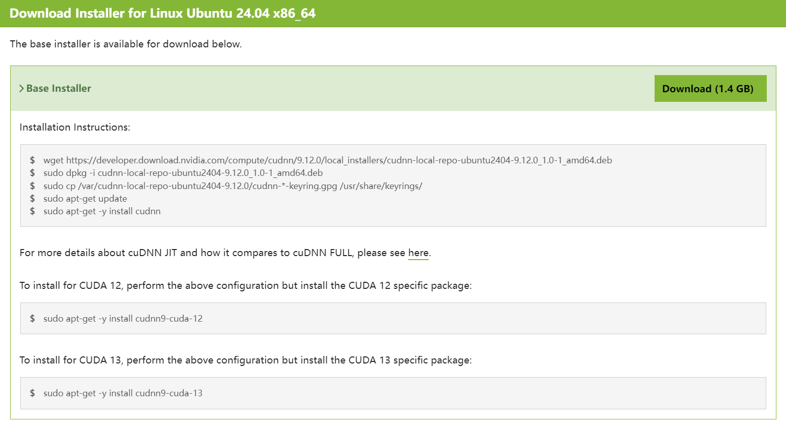



---

## 安装 CUDA Toolkit [^1]

!!! tip "选择合适的 CUDA 版本"

    选择 CUDA Toolkit 版本时，需要根据实际开发环境和版本兼容性进行选择，多个 CUDA 版本之间可以通过配置环境变量并存。

    !!! question "是否需要为 PyTorch 安装特定 CUDA？"

        在虚拟环境下，使用包管理器（`conda` 或 `pip`）安装 PyTorch 时，会自动安装所依赖版本的 CUDA 和
        cuDNN（作为 Python 软件包，如 `nvidia-cuda-runtime`），并与系统环境变量定义的 CUDA 和 cuDNN 版本相隔离，PyTorch
        会优先调用虚拟环境中的 CUDA 和 cuDNN。因此，**不需要在系统环境下为 PyTorch 安装特定版本的 CUDA 和 cuDNN**。

首先，删除过时的 GPG 密钥

``` console
$ sudo apt-key del 7fa2af80
```

=== "使用 APT 安装（网络安装）"

    安装 NVIDIA CUDA 密钥环，以获取最新软件源
    
    ``` console
    $ wget https://developer.download.nvidia.com/compute/cuda/repos/$distro/$arch/cuda-keyring_1.1-1_all.deb
    $ sudo dpkg -i cuda-keyring_1.1-1_all.deb
    $ sudo apt update
    ```
    
    ???+ example "根据实际版本和架构，`$distro/$arch` 需要替换为以下字段："

        - `ubuntu2004/x86_64`
        - `ubuntu2004/sbsa`
        - `ubuntu2004/arm64`
        - `ubuntu2204/x86_64`
        - `ubuntu2204/sbsa`
        - `ubuntu2204/arm64`
        - `ubuntu2404/x86_64`
        - `ubuntu2404/sbsa`
        - `ubuntu2404/arm64`

        详见：<https://developer.download.nvidia.com/compute/cuda/repos/>
    
    ---
    
    使用 APT 命令，选择一个合适的 CUDA Toolkit 版本进行安装
    
    ???+ example "可用的 CUDA Toolkit 版本 `${cuda-toolkit}`"

        - `cuda-toolkit-11-8`
        - `cuda-toolkit-12-0`
        - `cuda-toolkit-12-1`
        - `cuda-toolkit-12-2`
        - `cuda-toolkit-12-3`
        - `cuda-toolkit-12-4`
        - `cuda-toolkit-12-5`
        - `cuda-toolkit-12-6`
        - `cuda-toolkit-12-8`
        - `cuda-toolkit-12-9`
        - `cuda-toolkit-13-0`
        - `cuda-toolkit-13-1`

        !!! tip ""
    
            建议使用 ++tab++ 键自动补全，或执行 `apt search cuda-toolkit` 命令，搜索当前可用的 CUDA Toolkit 版本

    !!! note ""

        目前兼容性最佳的版本为：`CUDA Toolkit 11.8`
     
       ``` console
       $ sudo apt install ${cuda-toolkit}
       ```

=== "使用软件包安装（本地安装）"

    访问 [CUDA Toolkit Archive 官网](https://developer.nvidia.com/cuda-toolkit-archive)，根据实际开发需求，选择一个合适的版本
    
    !!! note ""

        目前兼容性最佳的版本为：`CUDA Toolkit 11.8`
    
    
    
    ---
    
    选择目标平台的操作系统、架构、发行版和安装类型
    
    !!! danger "务必选择 `deb (local)` 或 `runfile (local)` 方式安装"
    
        安装类型务必选择 `deb (local)` 或 `runfile (local)`，**使用 `deb (network)` 将会在线安装最新版**！

    !!! warning "注意选择是否安装 NVIDIA 显卡驱动"

        本地安装程序将附带 NVIDIA 显卡驱动且**默认勾选**，如果直接安装将会覆盖当前驱动版本
    
    

    /// caption
    图中，以 CUDA Toolkit 11.8 为例
    ///
    
    ---
    
    依照所选 Installer Type（安装类型）的安装命令进行安装
    
    

    /// caption
    图中，以 CUDA Toolkit 11.8、`runfile (local)` 为例
    ///

    ---

    以 `runfile (local)` 安装类型为例，运行安装程序，使用方向键选择 `Continue` 继续安装

    

    ---

    在下方输入 `accept` 并回车确认，接受 EULA 协议

    

    ---

    **务必取消勾选 `Driver` 项**，否则会重新安装显卡驱动，然后选择 `install` 开始安装

    

    ---

    安装完成后，留意 CUDA Toolkit 的安装路径 `PATH` 和 `LD_LIBRARY_PATH`

    

    /// caption
    图中，安装路径为 `/usr/local/cuda-11.8/`
    ///

    
---

编辑 `.bashrc` 文件，配置环境变量

``` console
$ gedit ~/.bashrc
```

---

将 CUDA 的路径 `PATH` 和 `LD_LIBRARY_PATH` 写入 `.bashrc` 文件

!!! tip annotate ""

    此处使用 `/usr/local/cuda/` 软链接指向了**最后安装的 CUDA 版本**，如果存在多个版本可以自行修改生效的版本 (1)

1. 可以使用下列命令查看所有已安装的 CUDA 版本：
   ``` console
   $ ls -l /usr/local/ | grep cuda
   ```

``` bash title=".bashrc"
export PATH=/usr/local/cuda/bin${PATH:+:${PATH}}
export LD_LIBRARY_PATH=/usr/local/cuda/lib64${LD_LIBRARY_PATH:+:${LD_LIBRARY_PATH}}
```


---

保存更改后，使用下列命令使配置立即生效：

``` console
$ source ~/.bashrc
```

---

安装完成后，查看 CUDA 版本以验证安装

``` console
$ nvcc --version
```

---

## 卸载 CUDA Toolkit

- **移除 CUDA Toolkit**

``` console
$ sudo apt --purge remove "*cuda*" "*cublas*" "*cufft*" "*cufile*" "*curand*" \
  "*cusolver*" "*cusparse*" "*gds-tools*" "*npp*" "*nvjpeg*" "nsight*" "*nvvm*"
```

- **清理缓存及无用的相关依赖**

``` console
$ sudo apt autoremove --purge -V
```

---

## 安装 cuDNN [^2]

!!! abstract "cuDNN（CUDA Deep Neural Network Library）"

    **NVIDIA CUDA 深度神经网络库（cuDNN）**是由 NVIDIA 推出的专为深度学习设计的 GPU 加速库，专注于优化深度神经网络的核心计算操作。
    它通过高度优化的卷积、池化、归一化和激活函数等算法，显著提升了训练和推理任务的效率，并与主流深度学习框架（如
    TensorFlow、PyTorch）无缝集成，使开发者无需手动编写底层代码即可充分利用 GPU 性能，广泛应用于学术和工业领域的高性能计算场景。

??? note annotate "更新至 cuDNN 9"

    2024年2月 cuDNN 9.0.0 发布，主要引入了对动态形状推理的优化支持，显著提升了可变输入尺寸场景（如自然语言处理）的计算效率，同时新增了针对
    Ampere 架构 GPU（如A100）的细粒度 Tensor Core 加速功能，优化了卷积、池化和归一化等核心操作的性能，并扩展了 API 以支持更灵活的模型设计。

    **为了获得最佳性能，建议安装最新的 cuDNN 9 及与之兼容的CUDA 11+ 版本 ！** (1)

1. cuDNN 9 可以与之前的 7/8 版本共存，安装新版本不会自动删除较旧的版本

---

安装 cuDNN 依赖项 zlib（数据压缩软件库）

``` console
$ sudo apt install zlib1g
```

=== "使用 APT 安装（网络安装）"

    !!! warning "默认安装最新版本"

        网络安装将默认安装最新版的 cuDNN，如需安装特定版本，建议使用软件包本地安装
    
    安装 NVIDIA CUDA 密钥环，以获取最新软件源

    > 如果在之前安装 CUDA Toolkit 时已添加密钥环，无需再重复安装！
    
    ``` console
    $ wget https://developer.download.nvidia.com/compute/cuda/repos/$distro/$arch/cuda-keyring_1.1-1_all.deb
    $ sudo dpkg -i cuda-keyring_1.1-1_all.deb
    $ sudo apt update
    ```
    
    ???+ example "根据实际版本和架构，将 `$distro/$arch` 替换为以下字段："
    
        - `ubuntu2004/x86_64`
        - `ubuntu2004/sbsa`
        - `ubuntu2004/arm64`
        - `ubuntu2204/x86_64`
        - `ubuntu2204/sbsa`
        - `ubuntu2204/arm64`
        - `ubuntu2404/x86_64`
        - `ubuntu2404/sbsa`
        - `ubuntu2404/arm64`
    
        详见：<https://developer.download.nvidia.com/compute/cuda/repos/>
    
    ---
    
    安装适用于 CUDA 版本的 cuDNN：

    === "CUDA 11"

        ``` console
        $ sudo apt install cudnn9-cuda-11
        ```
    
    === "CUDA 12"
    
        ``` console
        $ sudo apt install cudnn9-cuda-12
        ```
    
    === "CUDA 13"
    
        ``` console
        $ sudo apt install cudnn9-cuda-13
        ```

=== "使用 APT 安装（本地安装）"

    访问 [cuDNN Archive 官网](https://developer.nvidia.com/cudnn-archive)，选择一个合适的版本

    

    ---

    选择目标平台的操作系统、架构和发行版，其中，**安装类型选择 `deb (local)`，配置方案选择 `FULL`** (1)
    { .annotate }

    1. `FULL` 即为 cuDNN 完整版，`JIT` 版本通过仅支持图 API 的运行时融合引擎来实现体积缩减，但会略微减少支持范围和性能表现，详见：[Graphs — NVIDIA cuDNN Frontend](https://docs.nvidia.com/deeplearning/cudnn/frontend/v1.13.0/developer/graph-api.html#cudnn-jit)

    

    /// caption
    图中，以 cuDNN 9.12.0 为例
    ///

    ---

    依照所选安装类型的安装命令进行安装

    

    /// caption
    图中，以 cuDNN 9.12.0 为例
    ///

---

## 验证 cuDNN

安装 cuDNN 示例

``` console
$ sudo apt install libcudnn9-samples
```

---

编译 `mnistCUDNN` 示例

``` console
$ cd /usr/src/cudnn_samples_v9/mnistCUDNN

$ sudo make clean && sudo make
```

---

运行 `mnistCUDNN` 示例

``` console
$ ./mnistCUDNN
```

---

如果运行结果提示 `Test passed!`，则说明已正确安装 cuDNN


[^1]: [NVIDIA CUDA Installation Guide for Linux | Ubuntu](https://docs.nvidia.com/cuda/cuda-installation-guide-linux/index.html#ubuntu)
[^2]: [Installing cuDNN Backend on Linux — NVIDIA cuDNN Installation](https://docs.nvidia.com/deeplearning/cudnn/installation/latest/linux.html)
