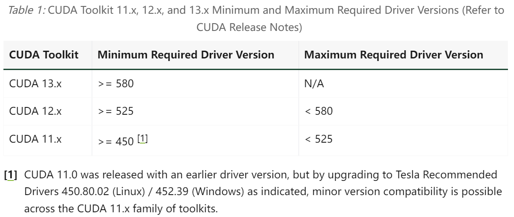

<!-- cuda-driver-compatibility-start -->
??? example "NVIDIA 显卡驱动、CUDA、PyTorch 和 Python 的版本兼容性要求"

    
    
    <table><thead>
      <tr>
        <th>PyTorch</th>
        <th>CUDA</th>
        <th>cuDNN</th>
        <th>Python</th>
      </tr></thead>
    <tbody>
      <tr>
        <td>2.10</td>
        <td rowspan="2">12.6, 12.8, 13.0</td>
        <td rowspan="2">~ 9.10, 9.13</td>
        <td rowspan="2">&gt;=3.10, &lt;=3.14</td>
      </tr>
      <tr>
        <td>2.9</td>
      </tr>
      <tr>
        <td>2.8</td>
        <td>12.6, 12.8, 12.9</td>
        <td>~ 9.10</td>
        <td rowspan="4">&gt;=3.9, &lt;=3.13</td>
      </tr>
      <tr>
        <td>2.7</td>
        <td>11.8, 12.6, 12.8</td>
        <td>~ 9.1, 9.5, 9.7</td>
      </tr>
      <tr>
        <td>2.6</td>
        <td>11.8, 12.4, 12.6</td>
        <td>~ 9.1, 9.5</td>
      </tr>
      <tr>
        <td>2.5</td>
        <td rowspan="2">11.8, 12.1, 12.4</td>
        <td rowspan="2">~ 9.1</td>
      </tr>
      <tr>
        <td>2.4</td>
        <td rowspan="3">&gt;=3.8, &lt;=3.12</td>
      </tr>
      <tr>
        <td>2.3</td>
        <td rowspan="3">11.8, 12.1</td>
        <td rowspan="3">~ 8.7</td>
      </tr>
      <tr>
        <td>2.2</td>
      </tr>
      <tr>
        <td>2.1</td>
        <td rowspan="2">&gt;= 3.8, &lt;=3.11</td>
      </tr>
      <tr>
        <td>2.0</td>
        <td>11.7, 11.8</td>
        <td>~ 8.5</td>
      </tr>
      <tr>
        <td>1.13</td>
        <td>11.6, 11.7</td>
        <td rowspan="2">~ 8.3</td>
        <td rowspan="2">&gt;= 3.7, &lt;=3.10</td>
      </tr>
      <tr>
        <td>1.12</td>
        <td>11.3, 11.6</td>
      </tr>
    </tbody></table>

    详见：[CUDA Toolkit and Corresponding Driver Versions](https://docs.nvidia.com/cuda/cuda-toolkit-release-notes/index.html#id9)
    和 [Releasing PyTorch | Release Compatibility Matrix](https://github.com/pytorch/pytorch/blob/main/RELEASE.md#release-compatibility-matrix)
<!-- cuda-driver-compatibility-end -->
